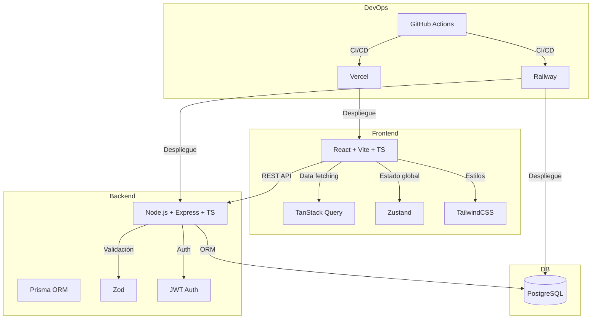

# Arquitectura del Sistema – CajaPyme

  

```mermaid

flowchart TD

subgraph Frontend

A[React + Vite + TS]

B[TanStack Query]

C[Zustand]

D[TailwindCSS]

end

subgraph Backend

E[Node.js + Express + TS]

F[Prisma ORM]

G[Zod]

H[JWT Auth]

end

subgraph DB

I[(PostgreSQL)]

end

subgraph DevOps

J[GitHub Actions]

K[Vercel]

L[Railway]

end

  

A -- REST API --> E

E -- ORM --> I

E -- Validación --> G

E -- Auth --> H

A -- Estado global --> C

A -- Estilos --> D

A -- Data fetching --> B

J -- CI/CD --> K

J -- CI/CD --> L

K -- Despliegue --> A

L -- Despliegue --> E

L -- Despliegue --> I

```

