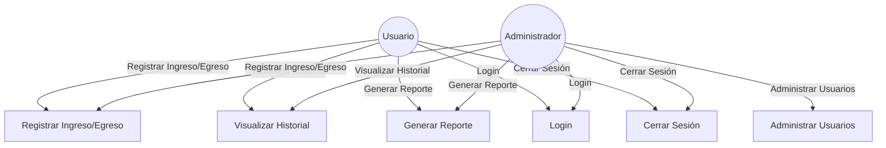

# Diagrama de Casos de Uso – CajaPyme

  

```mermaid

%% Usa '%%' para comentarios en Mermaid

%% Algunos plugins de Obsidian solo soportan '%%' y no 'usecaseDiagram'.

%% Usaremos 'graph TD' para máxima compatibilidad visual.

graph TD

Usuario((Usuario))

Administrador((Administrador))

  

Usuario -- Registrar Ingreso/Egreso --> RE[Registrar Ingreso/Egreso]

Usuario -- Visualizar Historial --> VH[Visualizar Historial]

Usuario -- Generar Reporte --> GR[Generar Reporte]

Usuario -- Login --> L[Login]

Usuario -- Cerrar Sesión --> CS[Cerrar Sesión]

  

Administrador -- Administrar Usuarios --> AU[Administrar Usuarios]

Administrador -- Registrar Ingreso/Egreso --> RE

Administrador -- Visualizar Historial --> VH

Administrador -- Generar Reporte --> GR

Administrador -- Login --> L

Administrador -- Cerrar Sesión --> CS

```
