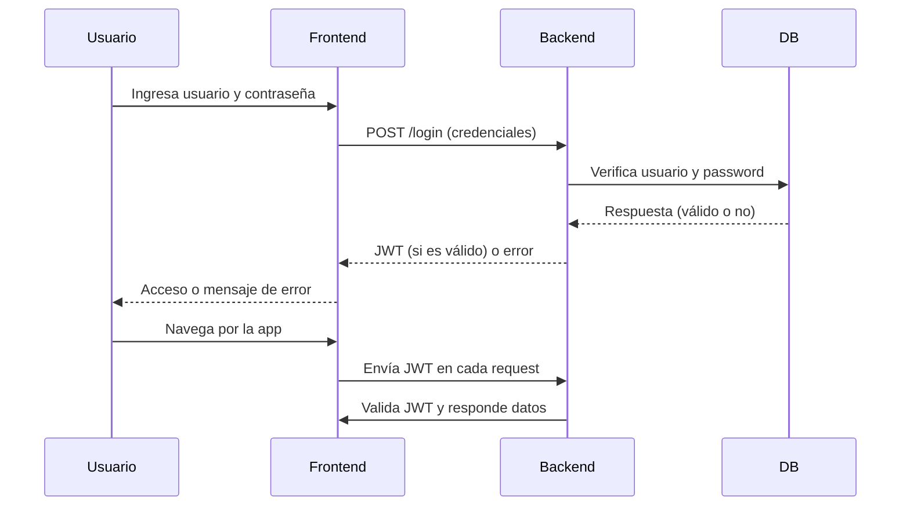

# Flujo de Autenticación – CajaPyme


```mermaid
sequenceDiagram
  participant Usuario
  participant Frontend
  participant Backend
  participant DB

  Usuario->>Frontend: Ingresa usuario y contraseña
  Frontend->>Backend: POST /login (credenciales)
  Backend->>DB: Verifica usuario y password
  DB-->>Backend: Respuesta (válido o no)
  Backend-->>Frontend: JWT (si es válido) o error
  Frontend-->>Usuario: Acceso o mensaje de error
  Usuario->>Frontend: Navega por la app
  Frontend->>Backend: Envía JWT en cada request
  Backend->>Frontend: Valida JWT y responde datos
```

> Si no ves el diagrama, revisa que el bloque comience con ```mermaid y no tenga metadatos YAML arriba.
